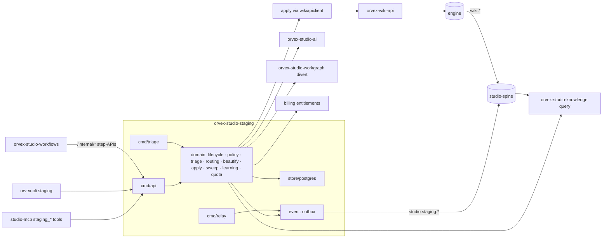
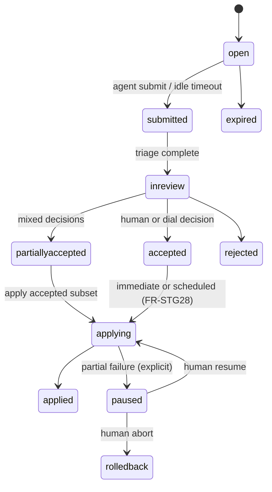

# Architecture Spine — orvex-studio-staging

## Design Paradigm

**A state-machine pipeline in the six-tier family-satellite shape.** Every Proposal and ChangeSet is a row owning an explicit state machine; the pipeline stages (intake → triage → review → apply → sweep) are bounded-context domain packages that only ever advance those machines via CAS transitions. The Librarian is a set of those packages, not a separate system.

Six-tier mapping (as-built family idiom, not the naive layout): `cmd/*` = multiple thin binaries; `internal/<context>/` = pure domain packages (`intake`, `triage`, `routing`, `beautify`, `policy`, `apply`, `sweep`, `learning`, `quota`); `internal/workflow/` = request/event-scoped sequencing only; `internal/store/postgres/` = the only driver import; `internal/event/` = outbox + spine consumers via `orvex-studio-lib/pkg/events`; `internal/cache/` = Redis speed-only; `internal/clients/` = typed sibling clients from `orvex-studio-lib`.

## Inherited Invariants

| Inherited | From parent | Binds here |
| --- | --- | --- |
| CS ❌1–12, six-tier prohibitions, TDD contract | Coding Standards `6aMAzsYeQb` (carried: project-context.md) | tier discipline, no driver leakage, no own-package mocks, no `any`/`interface{}` laundering, vertical slices |
| P1 / P10 | Arch & Principles `CxjFpIVUZY` | closed Go satellite; never imports `@docmost/*`; AGPL reuse is network-only |
| P2 + D-S13 | canon | every mutation → outbox → relay → Kafka `studio-spine` CloudEvent; consume via Knative Trigger; no Redis bridge, no polling |
| P3 + ADR-0008 | canon / ADR | contracts authored in `orvex-studio-contracts` first, tag-pinned; additive = automated lane, reshaping = ADR + human ratify |
| P4 + ADR-0009 | canon / ADR | auth only via `orvex-studio-lib/pkg/auth`; deny-by-default scope; `VerifyFresh` on high-privilege; never talk to an IdP |
| P5 + D-S12 + ADR-0014 | canon / ADR | Postgres (CNPG, RLS fail-closed) for relational/CAS state; Redis speed-only; Rook-Ceph S3 for objects; Turbopuffer is the sole search store — no pgvector, no Mongo |
| P6 + D-WF-1 | canon | no own Temporal worker; durable flows live in `orvex-studio-workflows` calling this service's idempotent `/internal/*` step-APIs; ID-only payloads |
| P8 / P9 | canon | fail-closed live ACL narrowing on every content egress + the CI/post-deploy isolation probes; a new *content source* registers a contracts source-adapter (staging is not one — AD-9) |
| ADR-0001 / ADR-0012 | ADR | polymorphic `{user\|org}` tenant everywhere; an org-only assumption is a bug; personal-tenant CI probe |
| ADR-0003 | ADR | frozen 402 `QUOTA_EXCEEDED`; verdict is a domain fn; never 429, never destructive; entitlements are billing-owned |
| ADR-0007 + ADR-0010 D2/D3 | ADR | envelope required set `[specversion,id,source,type,orvexcell,orvextenant]`, `partitionkey`=tenant; types `studio.<sub>.<past-tense>` |
| ADR-0011 D5 + cell-lint 1–14 | ADR / `JGAUQRsw2g` | cell-local (no new global singleton); UUIDv7 PKs; every table tenant-keyed, no `cell_id` column; `Idempotency-Key` on all `/internal/*`; `TenantMoveManifest` covers declared stores; topics `{domain}-events.{cell}` partitions:1; no KEDA; no host literals |
| ADR-0015 | ADR | never a cross-DB read/FK; cross-service integrity = delete-events + idempotent orphan-sweep; existence reads via contracts API |
| ADR-0016 | ADR | OTel via `pkg/obs`; trace context persisted across the outbox seam as DT extension attrs; consumers LINK; PII deny-list in all telemetry |
| Ruling 5 + no-fallbacks (Daniel) | canon / PO | full family always ships — no absent-satellite degradation path; migrations are hard cuts with loud errors, never shims |

## Invariants & Rules

### AD-1 — One service, Librarian included [ADOPTED: PRD OQ1 resolved]

- **Binds:** all
- **Prevents:** a second deployable (and a second contract surface) for what is one pipeline; drift between "staging" and "librarian" halves
- **Rule:** `orvex-studio-staging` is a single closed Go satellite (own repo, own CNPG Postgres, cell-local ApplicationSet deploy). The Librarian is its triage/routing/beautify/policy/learning/sweep domain packages plus worker binaries — never a separate service. Binaries: `cmd/api` (request-serving), `cmd/triage` (queue worker), `cmd/relay` (outbox relay), `cmd/sweep` (executor for the FR-STG18–21 maintenance work that AD-5's workflows schedules dispatch via step-APIs — the schedule lives centrally, the sweep compute lives here).

### AD-2 — State machines are the only mutation path

- **Binds:** FR-STG1–5, FR-STG9–13, FR-STG28
- **Prevents:** two writers advancing a Proposal differently; state divergence between store, events, and UI
- **Rule:** Proposal and ChangeSet rows carry the PRD's exact state enums; every transition is a CAS `UPDATE … WHERE state = $expected` executed by the one `internal/lifecycle` package, in the same transaction as its outbox event. No other package writes state columns. A ChangeSet cannot reach `applied` while any member Proposal is unresolved (workflow-state gate, never cross-store ACID); a paused mid-apply ChangeSet names applied-vs-pending members and waits for an explicit human resume/abort. Scheduled applies (FR-STG28) store the UTC instant computed at creation plus the origin IANA tzid; firing uses the instant. `lifecycle` exports the single in-flight predicate (every non-terminal state) that quota and admission consume.

### AD-3 — Conflict keying and authoritative reads [ADOPTED]

- **Binds:** FR-STG4, FR-STG9, FR-STG13, FR-STG14
- **Prevents:** silent overwrites of human edits; anchor guessing; whole-page rewrites riding section edits
- **Rule:** section-scoped Operations key conflicts on `(document_id, section_anchor)` where the anchor is a stable engine block ID (UniqueID), never heading text; document-scoped Operations are whole-doc-keyed. Base-version stamps at submit and is the wiki-api version token verbatim (the same counter as `ifVersion`) — timestamps are display-only, never CAS inputs. Pre-apply re-check reads the authoritative content path (wiki-api / ydoc-backed), never the ≤45s-stale content column. A moved base at the conflict key = `conflict` Disposition for a human; three-way prose auto-merge is forbidden. Multi-Proposal applies to one page re-resolve every subsequent anchor after each write; a lost anchor is a `conflict`, never a guess.

### AD-4 — Wiki writes only through the wiki-api chokepoint [ADOPTED]

- **Binds:** FR-STG13, FR-STG25, NFR-STG5, SM-1
- **Prevents:** bypass paths surviving the hard cut; agent credentials ever reaching the engine
- **Rule:** the apply engine calls `orvex-wiki-api` exclusively (lib `wikiapiclient`), with CAS `ifVersion`, per-page block ops, and per-item receipts; the engine's direct write routes are network-fenced to wiki-api (infra config, not a fork edit). Credential classes are enforced at wiki-api ingress: agent-class tokens get 403 + a migration error naming `orvex-cli staging`; only human credentials and the Librarian apply engine's privileged service credential pass. Apply holds a per-(tenant, page) lease so concurrent ChangeSets (immediate, scheduled, sweep) serialize per page; a CAS loss inside a held lease is a `conflict` → pause, never a blind retry. `replace-document`/`delete-document` snapshot-before-mutate through the staging service (snapshot bytes in S3 per AD-10, pointers in Postgres); additive/edit ops roll back via inverse Proposals. Applied content lands at wiki status draft/published per tenant policy `[ASSUMPTION]`; **canonical promotion keeps its human doc-ratify contract — the Librarian never self-promotes page status.** Wiki-api write-facade promotion past 501 is a prerequisite epic; the hard cut of all agent write surfaces is the LAST release step, gated on staging running end-to-end against non-501 `orvex-studio-ai` + `orvex-studio-knowledge`.

### AD-5 — Durable orchestration is central, checkpoints are local

- **Binds:** FR-STG13, FR-STG28, NFR-STG3, maintenance sweeps
- **Prevents:** a satellite Temporal worker (D-WF-1 violation); non-resumable applies; replayed side-effects
- **Rule:** apply runs, scheduled publishing, and sweep schedules are Temporal workflows in `orvex-studio-workflows` whose activities call this service's idempotent `/internal/*` step-APIs (`Idempotency-Key` mandatory, payloads are IDs only). Each step-API is a small CAS state transition, so any retry/replay is a no-op. Idempotency keys derive as `f(workflow_run_id, step, target_id)` — stable across retries; the key ledger is the primary dedup authority and CAS transitions are defense-in-depth. `internal/workflow/` stays request-scoped sequencing only.

### AD-6 — Model and search access ride the family seams [ADOPTED]

- **Binds:** FR-STG7, FR-STG8, FR-STG14, FR-STG16, FR-STG18–21, NFR-STG1
- **Prevents:** a second LLM egress path; staging growing its own index
- **Rule:** every LLM call (classify, route, beautify, learn) goes through `orvex-studio-ai` under a per-tenant rate budget named in the contracts seam; staging owns orchestration and Prompt Packs, never model access or provider credentials. Duplicate/routing candidates and reindex state come from `orvex-studio-knowledge`'s query API. The `divert-to-workgraph` Disposition (PRD renamed 2026-07-10, formerly divert-to-memory) targets `orvex-studio-workgraph` via the lib `workgraphclient` on accept — never the wiki path — with cross-links persisted on both sides and the shared sha256 content-hash (defined once in the contract) backing workgraph's cycle rejection. Retrieval trust-gating enforcement lives inside knowledge (v1 dependency deliverable); the gating contract lands in `orvex-studio-contracts`, and the FR-STG22 groundability/review-state flag rides that same contract — page-meta as the store (AD-7), knowledge as the enforcer — which is what makes SM-C3's "zero by construction" true.

### AD-7 — The dial is a server-side domain verdict [ADOPTED]

- **Binds:** FR-STG10–12, FR-STG22, SM-C1, SM-C3
- **Prevents:** prompt text or a surface (MCP/CLI/UI) deciding autonomy; destructive ops slipping a gate
- **Rule:** the `policy` domain package computes every autonomy verdict from (dial position per tenant+space) × (Operation risk class) × (producer Trust Tier) × (routing confidence). Routing confidence is a float in [0,1], 1 = certain, produced solely by `routing`; the adjudication threshold is tenant policy. Surfaces marshal verdicts; they never compute them. Destructive Operations are human-gated below `full-auto`; routes below the confidence threshold always join the mandatory per-item adjudication lane and are excluded from bulk-accept; auto-applied-but-unreviewed content is not agent-groundable until post-hoc review flips the FR-STG22 flag; the groundability flag is human-settable, decoupled from human ACLs, lives in wiki-api page-meta (the engine's side-table), is mutated only through wiki-api, and knowledge reads it from the wiki side — never from staging. Every auto-apply records its justification as an event. Trust Tiers also gate intake pace — producers with sustained rejection history are throttled at admission (FR-STG11). Maintenance-sweep recommendations carry their own daily interaction budget, separate from the intake budget SM-3 guards, and sweeps propose writes only against agent-authored pages — human-authored pages receive flag-only findings unless the tenant opts in (§5 non-goal: the human edit path stays untouched).

### AD-8 — Tenancy, credentials, and trust keying

- **Binds:** FR-STG5, FR-STG11, FR-STG23, NFR-STG4, NFR-STG5
- **Prevents:** the as-built trusted-header seam recurring; trust computed from spoofable ids; RLS deferred like current satellites
- **Rule:** every request verifies via `orvex-studio-lib/pkg/auth` `Middleware` (per-agent identity-minted scoped tokens; `VerifyFresh` on apply, dial changes, and pack approval). Trust Tiers and provenance key on the *verified* principal, never a body-supplied id (the Curator cap-keyed-on-principal golden transfers); ChangeSets group on the server-derived session reference from the verified token, never a body-supplied session id. RLS policies (`app.tenant` GUC, fail-closed) ship in the baseline migration, not as a follow-up. The P8 isolation probes (cross-tenant, intra-tenant restricted-content, count-oracle) run in CI and post-deploy against staging's read surfaces. Two-sided provenance (agent identity + triggering session) is immutable on every Proposal and survives into wiki history and audit events.

### AD-9 — `studio.staging.*` events are telemetry, wiki.* is truth

- **Binds:** FR-STG26, NFR-STG4, NFR-STG6
- **Prevents:** dual reindex triggers; consumers treating staging events as wiki mutations; unpinned schemas hard-pinned downstream
- **Rule:** every staging state change emits a `studio.staging.<resource>.<past-tense>` CloudEvent (ADR-0007 envelope) from the transactional outbox. Knowledge reindexes wiki content from the ENGINE's `wiki.*` events after apply — staging events carry queue/decision/audit telemetry and never trigger a second reindex. The engine's outbox (`wiki.*` producer) is therefore a gating prerequisite alongside the wiki-api/ai/knowledge 501 promotions: the engine emits zero events today, and reindex-on-apply is dark until it ships. (FR-STG26 amended accordingly 2026-07-10 — the PRD now names the engine's `wiki.*` events as the reindex trigger and the engine outbox as a gating prerequisite.) Event types + payload schemas + the topic-domain addition are authored in `orvex-studio-contracts` before build (additive lane); staging enrolls in the AGPL-import denylist and drift gates. The 402 `errors/vocabulary.yaml` `surfaces` addition is a QUOTA-contract change and takes the ADR + human-ratify lane (ADR-0003 D5, ADR-0008 fail-safe). Staging is not a P9 content source — no source-adapter entry.

### AD-10 — Pointer-state payloads [ADOPTED]

- **Binds:** FR-STG6, FR-STG13, NFR-STG1
- **Prevents:** queue rows pinning content; S3 keys leaking tenancy
- **Rule:** Proposal bodies and pre-mutate snapshots live in Rook-Ceph S3 under `{tenant_id}/…` keys; queue rows carry pointer + sha256 content-hash only. The declared datastore set (Postgres + S3 prefixes) is covered by `TENANT_MOVE.md` / `TenantMoveManifest` from day one. GDPR erasure cascades through payloads, snapshots, decision history, and audit references — audit immutability is satisfied by content-free tombstones, never by retaining erased content.

### AD-11 — Quota verdicts are domain, entitlements are billing's [ADOPTED]

- **Binds:** FR-STG3, NFR-STG2, SM-4, SM-C2
- **Prevents:** caps embedded in handlers; a second entitlement store; 429/destructive behavior on cap
- **Rule:** admission control (per-session and per-tenant in-flight caps, queue depth/age) is computed by the `quota` domain package against billing-owned entitlements read through `billingclient`; at-cap write surfaces return the frozen 402 `QUOTA_EXCEEDED` shape. Apply-rate throttling toward the engine is per-tenant and config-owned, never hardcoded. Queue metrics report acceptance-weighted proposal volume (SM-C2) — raw volume is never a success signal. Public write verbs (`staging_propose`, changeset submit, decide, apply) accept an `Idempotency-Key`; agent retries deduplicate rather than double-count against quota.

### AD-12 — Supersession is verbatim, the cut is loud [ADOPTED]

- **Binds:** §9, FR-STG25, SM-1
- **Prevents:** silent Card-v1 semantic breaks; two classification paths; a shimmed legacy write path
- **Rule:** Proposal is a strict superset of Card Contract v1 — the outside-proposed vs inside-resolved field-authority split transfers verbatim, and the shipped Curator goldens (idempotency, cap-keyed-on-verified-principal, degrade reasons `sibling-unreachable`/`cap-exhausted`, no-direct-LLM) must pass against the documented Card→Proposal mapping. `classifyOnSave` becomes a capture on-ramp forwarding to staging submit; its local classify path is removed at cutover with a loud migration error. MCP `save_page`/`edit` re-point to emit Proposals; hidden `studio_library_save`/`studio_librarian_session` passthroughs are absorbed or removed; agent-class CLI wiki writes 403 at wiki-api. No dual-write, no shim.

### AD-13 — Beautify at triage; review-what-you-apply [ADOPTED]

- **Binds:** FR-STG13, FR-STG14, FR-STG21, NFR-STG1
- **Prevents:** LLM latency inside the apply SLO; approved diffs diverging from applied bytes; unknown-node silent stripping
- **Rule:** the Librarian re-authors content during triage — the rendered diff the reviewer approves IS the final content; apply performs mechanical engine writes only. Beautified output is stored as an immutable sha256-addressed artifact at triage; the review queue renders and apply writes that exact artifact by hash — apply never re-authors. Content schema-validation happens once, at intake (lossy formats and unregistered nodes rejected at the door); downstream stages trust the validated payload. Section re-authoring preserves the target section's block anchor ID verbatim — re-anchoring is never triggered by our own beautification. Re-authoring scope matches Operation granularity (section ops touch only their section). Only schema-registered ProseMirror nodes are authored (zero stripped-node warnings); apply verification is full-text + effective-marks equality per affected section (the engine coalesces same-mark runs).

### AD-14 — Learning is captured, versioned, and admin-gated

- **Binds:** FR-STG15–17, FR-STG27, FR-STG29, SM-2
- **Prevents:** silent prompt drift; cross-tenant contamination; unattributable behavior change
- **Rule:** Feedback Events are append-only rows linked to Proposal + Disposition + pack version — each Disposition records the pack version that produced it and its Feedback Events inherit that version, never a re-read of the currently-active pack. Trust Tiers are a single versioned entity owned by `learning`, recomputed on feedback; `policy` and `quota` snapshot the tier at admission (no mid-session drift). Learning application = feedback-drawn exemplars + tier recalibration + Librarian-*proposed* pack revisions, each injection/recalibration logged for attribution; a pack revision (manual, self-proposed, or marketplace-installed) activates only through admin approval. Exemplars and packs are tenant-scoped; cold-start ships content-free generic exemplars; marketplace packs are content-free by construction. Learning effect is validated by the held-out exemplars-on/off harness, not the raw SM-2 trend.

### Dependency direction



Arrows are the only permitted dependency directions. Forbidden edges: staging → engine DB or engine HTTP (only wiki-api), staging → any sibling's Postgres, surfaces → store, domain → drivers, ai/knowledge → staging store.

## Consistency Conventions

| Concern | Convention |
| --- | --- |
| Naming | service `orvex-studio-staging`; space `orvexstudiostaging`; MCP tools `staging_*` (new `staging-tools.ts`, hidden category `staging` via `list_tools`, registered before `installToolVisibility`); CLI `orvex-cli staging <verb>`; events `studio.staging.<resource>.<past-tense>`; step-APIs `/internal/<verb>`; cluster-internal — no dedicated public flat host: browser/CLI traffic reaches it through the Studio plane's same-origin `/api/*` proxy to the home cell `[ASSUMPTION: confirm at the M12 CLI wiring]` |
| Data & formats | UUIDv7 PKs; tenant column `tenant` (polymorphic id); server-issued ids in receipts; error body = contracts `Error` envelope + frozen `ErrorCode` vocabulary; content payloads DfM or ProseMirror JSON only (lossy formats rejected); sha256 content-hashes; `SubmitReceipt` (proposal id + ChangeSet id + disposition forecast) and `ApplyReceipt` (per-item apply outcome) are distinct contract shapes |
| State & cross-cutting | state via `lifecycle` CAS only (AD-2); config via `internal/config.Load()` env-only (`ORVEX_<SVC>_URL`, `CELL_ID`, `CLUSTER_NAME`); secrets OpenBao+ESO; sibling calls via lib typed clients — extend `orvex-studio-lib` with missing clients (`aiclient`, `workgraphclient`) rather than hand-rolling `internal/clients` |
| Migrations & tests | `NNNN_name.sql` forward-only idempotent, advisory-lock applier, RLS policies in `0001`; store tested via testcontainers inside the store package only; siblings faked from contracts golden fixtures; never mock own packages |
| CI/CD | self-hosted `runners` group; images built and pushed by Tekton→Harbor exclusively (CI never builds or pushes images); cell-lint reusable workflow + org required-status ruleset; private lib via OIDC→OpenBao clone token (`GOPRIVATE=github.com/orvexai/*`) |
| Observability | `/healthz` + `/readyz` echo `CELL_ID`+`CLUSTER_NAME`; OTel via `pkg/obs` (stub today — wiring it is early scope); trace context as DT extension attrs on events, consumers LINK; Proposal/page content and end-user text NEVER appear in spans, logs, or metrics labels |

## Stack

| Name | Version |
| --- | --- |
| Go | 1.26.0 (`toolchain go1.26.5`) |
| orvex-studio-lib | v0.3.1 |
| jackc/pgx/v5 (pgxpool) | v5.10.0 |
| PostgreSQL / CNPG | 18 / operator v1.30.0 |
| orvex-studio-contracts | pinned release tag (v0.1.2 at authoring) |
| testcontainers-go | v0.43.0 |
| Temporal (central, via workflows svc) | server v1.31.2 · Go SDK v1.46.0 |
| MCP server side (TS, existing repo) | @modelcontextprotocol/sdk ^1.29 · zod 4 |
| Object store | Rook-Ceph S3 (platform) |

## Structural Seed

```text
orvex-studio-staging/
  cmd/{api,triage,relay,sweep}/     # thin mains only
  internal/
    lifecycle/    # Proposal/ChangeSet state machines (AD-2)
    intake/       # submit, admission, base-version stamping
    triage/       # Disposition production (LLM orchestration)
    routing/      # find-before-create, confidence scoring
    beautify/     # triage-time re-authoring + mechanical done-bar
    policy/       # dial · trust tiers · risk gates (AD-7)
    apply/        # engine-write sequencing, receipts, snapshots
    sweep/        # duplicate/staleness/hygiene/beautify sweeps
    learning/     # feedback events, exemplars, pack revisions
    quota/        # admission verdicts (402)
    workflow/     # request-scoped sequencing only
    store/postgres/   # repositories + migrations/ (embedded)
    event/        # outbox writer, relay, spine consumers
    cache/        # Redis speed-only
    clients/      # lib-client wiring (ai, knowledge, billing, wikiapi, workgraph)
    config/  server/  auth/
  gen/            # codegen'd from contracts tag
  migrations/     # reviewable DDL source of truth
  deploy/kustomize/  tekton/
```

ChangeSet lifecycle (PRD FR-STG2, the row every surface renders):



## Capability → Architecture Map

| Capability | Lives in | Governed by |
| --- | --- | --- |
| FR-STG1–6 intake, quotas, provenance, pointers | `intake`, `quota`, `lifecycle`, S3 | AD-2, AD-8, AD-10, AD-11 |
| FR-STG7–9 triage, routing, conflicts | `triage`, `routing`, `cmd/triage` | AD-3, AD-6 |
| FR-STG10–12 dial, tiers, review queue | `policy` + review surface | AD-7 |
| FR-STG13 apply engine | `apply` + workflows step-APIs | AD-2, AD-3, AD-4, AD-5 |
| FR-STG14, FR-STG21 beautification | `beautify` | AD-13 |
| FR-STG15–17, FR-STG27, FR-STG29 learning + packs | `learning` | AD-14 |
| FR-STG18–22 maintenance mandate | `sweep` (+ knowledge trust-gating dep) | AD-6, AD-7 |
| FR-STG23–24 MCP + CLI sections | studio-mcp `staging-tools.ts`; orvex-cli | AD-8, conventions |
| FR-STG25 hard cut | wiki-api ingress + MCP/CLI repoints | AD-4, AD-12 |
| FR-STG26 events | `event` + contracts | AD-9 |
| FR-STG28 scheduled publishing | workflows + `lifecycle` | AD-2, AD-5 |
| NFR-STG1 benchmark gate | `test/e2e` + real deps | AD-5, AD-6 |
| NFR-STG2–6 isolation · durability · audit · security · observability | cross-cutting | AD-4, AD-5, AD-8–AD-11, conventions |

## Deferred

- **Dial granularity per doc-type** (PRD OQ4) — ship per-tenant + per-space; the `policy` verdict signature already takes a scope key, so doc-type refines later without reshaping.
- **Snapshot & rejected-payload retention windows** (PRD OQ3) — per-tenant config with `[ASSUMPTION: 30-day purge of rejected/expired payloads, 90-day snapshots]`; revisit at the privacy review before GA.
- **Review-queue UI host** — the queue API is this service's; whether the human surface renders in the Studio product UI or console is a UX/epics decision, not a spine invariant.
- **Workload shape per binary** (Deployment vs Knative per P7) — decided at deploy manifests; the binaries are shaped for either.
- **Numeric SLO values** (NFR-STG1, incl. the FR-STG1 500ms submit p95 and FR-STG7 triage SLO) — provisional until the 100-Proposal benchmark against non-501 deps; the benchmark run publishes the contract.
- **Card v1 → Proposal field-mapping table** (PRD OQ5) — produced and golden-verified in the migration epic; AD-12 fixes its verbatim-superset semantics.
- **Prompt-pack marketplace mechanics beyond the existing marketplace seam** (FR-STG29) — v1-minimal rides `studio_marketplace_*`; deeper marketplace product work is out of this spine.
