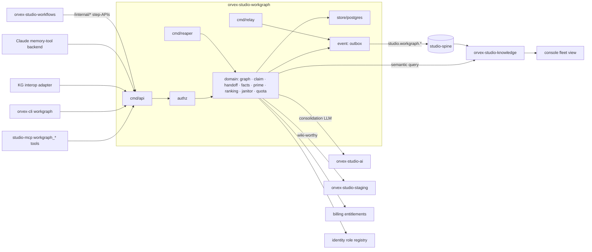
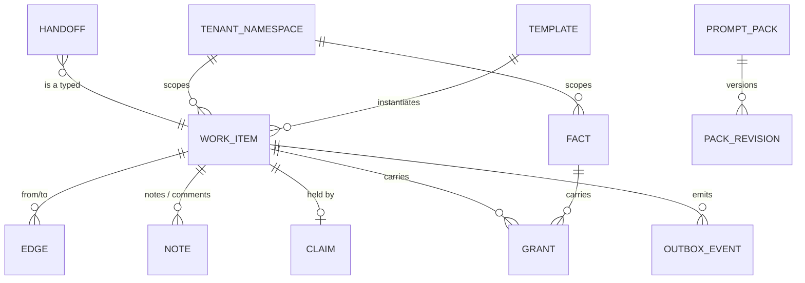

# Architecture Spine — orvex-studio-workgraph

## Design Paradigm

**A blackboard coordination kernel.** Agents coordinate exclusively through a shared structured store — work items, typed edges, claims, handoffs, remembered facts — which they read at session start (`prime`) and mutate through cheap direct writes. The hot path is pure transactional Postgres; intelligence (consolidation, compaction) runs as asynchronous janitors that never touch live coordination state. Naming is load-bearing: **`memory` means the user-managed memory product and is never used for this service**; `workgraph` is always written in full (never `wg`/`work`) to keep distance from `orvex-studio-workflows`.

Six-tier mapping: `cmd/*` thin mains; `internal/<context>/` = `graph` (items/edges), `claim` (leases), `handoff`, `facts` (remember/recall), `prime`, `ranking` (retrieval fusion), `janitor` (consolidation/compaction), `authz` (grants), `quota`; `internal/workflow/` request-scoped only; `internal/store/postgres/` sole driver import; `internal/event/` outbox + consumers; `internal/cache/` Redis speed-only; `internal/clients/` lib typed clients.

## Inherited Invariants

| Inherited | From parent | Binds here |
| --- | --- | --- |
| CS ❌1–12, six-tier prohibitions, TDD contract | Coding Standards `6aMAzsYeQb` (carried: project-context.md) | tier discipline, no driver leakage, no own-package mocks, no type-laundering, vertical slices |
| P1 / P10 | Arch & Principles `CxjFpIVUZY` | closed Go satellite; never imports `@docmost/*`; AGPL reuse network-only |
| P2 + D-S13 | canon | outbox → relay → Kafka `studio-spine`; Knative Trigger consumption; no polling, no Redis bridge |
| P3 + ADR-0008 | canon / ADR | contracts-first, tag-pinned; additive = automated lane; reshaping = ADR + ratify |
| P4 + ADR-0009 | canon / ADR | auth only via `orvex-studio-lib/pkg/auth`; deny-by-default; `VerifyFresh` on high-privilege; never call an IdP |
| P5 + D-S12 + ADR-0014 | canon / ADR | Postgres (CNPG, RLS fail-closed) for relational/CAS state; **Turbopuffer is the family's sole vector/search store — this service ships no pgvector**; Redis speed-only; S3 objects |
| P6 + D-WF-1 | canon | no own Temporal worker; schedules live in `orvex-studio-workflows` calling idempotent `/internal/*` step-APIs |
| P8 / P9 | canon | fail-closed live ACL narrowing on every egress; becoming a content source = a contracts source-adapter entry |
| ADR-0001 / ADR-0012 | ADR | polymorphic `{user\|org}` tenant; org-only assumptions are bugs; personal-tenant probe |
| ADR-0003 | ADR | frozen 402 `QUOTA_EXCEEDED`; verdict is domain; never 429/destructive |
| ADR-0007 + ADR-0010 D2/D3 | ADR | envelope required set + `orvexcell`/`orvextenant`; `partitionkey`=tenant; types `studio.<sub>.<past-tense>` |
| ADR-0011 D5 + cell-lint 1–14 | ADR / `JGAUQRsw2g` | cell-local; UUIDv7 PKs; tenant-keyed tables, no `cell_id` column; `Idempotency-Key` on `/internal/*`; `TenantMoveManifest` coverage; topics partitions:1; no KEDA; no host literals |
| ADR-0015 | ADR | no cross-DB read/FK; integrity via delete-events + idempotent orphan-sweep |
| ADR-0016 | ADR | OTel via `pkg/obs`; DT extension attrs across the outbox seam; consumers LINK; PII deny-list — item titles/notes/fact text never in telemetry |
| Ruling 5 + no-fallbacks (Daniel) | canon / PO | full family ships; hard cuts with loud errors, no shims |

## Invariants & Rules

### AD-1 — workgraph is its own greenfield service [ADOPTED: PO rename + FormSpec split, 2026-07-10]

- **Binds:** all; PRD §9, FR-MEM21–22
- **Prevents:** re-conflating agent state with user-managed memory; a phantom data migration; namespace collision with ADR-0010
- **Rule:** `orvex-studio-workgraph` (own repo, own CNPG Postgres, cell-local; binaries `cmd/{api,relay,reaper}`) holds **agent coordination state only**. The user-managed memory product (`/v1/memory` FormSpec, `studio.memory.*`, `studio_memory_*` tools) stays product-side, untouched and unmigrated — workgraph starts empty. What transfers is design only: the 3-state privacy enum (`open | private | shared-private`) as the base of AD-9's grants. The service supersedes the OPS agent-memory design and the PRD's conceptual predecessors. The hidden `studio_memory_get/save` MCP tools are user-memory FormSpec wrappers — under the split they remain product-side surfaces, not stubbed or removed by this service; workgraph's only obligation is the disambiguation pointer in their tool descriptions directing agent-state usage to `workgraph_*`. FR-MEM ids remain the PRD's stable requirement ids. (PRD amended accordingly on 2026-07-10: retitled "PRD: Workgraph", FR-MEM21/22 rescoped, §9 supersession split, pgvector references removed.) Fenced out with the PRD §5: no LLM knowledge-graph extraction over conversations, no peer-to-peer federation/sync, no agent mail, no orchestration engine. beads concepts are clean-room reimplementations with MIT attribution recorded in the repo's NOTICE.

### AD-2 — The hot path is single-store, zero-LLM, zero-fanout [ADOPTED]

- **Binds:** FR-MEM1–9, NFR-MEM1, NFR-MEM6, SM-2
- **Prevents:** Zep-style LLM-in-the-loop latency; a cross-service call inside `claim`; double-claims under degradation
- **Rule:** every coordination verb (`create/update/close/claim/heartbeat/handoff/batch/defer/remember/recall-by-key/prime-compact`) executes as row-level Postgres transactions in this service alone — no LLM call, no sibling-service call, no vector query, ever. `claim` is one CAS statement (assignee + status together); `heartbeat` is owner-only; `batch` is one transaction (FR-MEM6); `close --claim-next` is a best-effort follow-on — a failed next-claim never rolls back the close. Fast-path reads (exact-key recall, pinned-only prime-compact) must plan as index scans. Degraded mode returns honest-empty with status; `claim` stays server-side CAS so a stale-blind claim fails on conflict rather than double-claiming.

### AD-3 — The semantic leg rides knowledge, not a local vector store [ADOPTED: PO 2026-07-10 "if turbopuffer will function better let's go for it"]

- **Binds:** FR-MEM10, FR-MEM11 (top-k), FR-MEM16, NFR-MEM1/2/7, SM-1
- **Prevents:** a second live vector store in the family (ADR-0014's rejected shape); grants bypass via search; silent staleness lies
- **Rule:** workgraph registers as a P9 source-adapter; knowledge indexes items/notes/facts from `studio.workgraph.*` rich events into Turbopuffer (namespace-per-tenant, structural isolation). Semantic retrieval = `ranking` calling knowledge-query with the caller's principal; knowledge narrows through workgraph's declared `acl_primitive` live (P8), and `ranking` re-filters authoritatively against AD-9 grants — authorization is enforced on both sides, egress narrower wins. The cross-tenant bytes=0 isolation probe (ADR-0014 D3) plus the intra-tenant restricted-content and count-oracle probes (P8) bind both the knowledge-indexed corpus and workgraph's own read surfaces, in CI and post-deploy. Hybrid fusion (semantic × keyword tsvector × graph adjacency × recency/importance) is computed in `ranking`; the Postgres legs alone must return correct (if less semantic) results for content newer than the projection lag, and elision/staleness is bannered, never silent. The PRD's retrieval spike validates the ≤500ms hybrid / ≤100ms fast-path SLOs on this topology **before GA; if the spike fails the budget, the remedy is an ADR-0014 carve-out ADR (revisit), never a quiet local index**. Consolidation's top-k similar lookup uses the same knowledge path (async, latency-tolerant).

### AD-4 — Ready/blocked is denormalized with incremental repair

- **Binds:** FR-MEM2–3, FR-MEM26, NFR-MEM2
- **Prevents:** full-graph recomputes under batch load; blocks-cycles corrupting ready-work
- **Rule:** the canonical item model is pinned in the contracts tag: `status ∈ {open, in-progress, closed}` (single-valued lifecycle) with `blocked`, `deferred`, and claim-existence as **orthogonal dimensions**, never enum members; `ready ≝ status=open ∧ ¬blocked ∧ ¬deferred ∧ ¬claimed`. `blocked` is a denormalized flag owned by ONE `recomputeBlocked(affectedSet)` primitive — edge writes, gate resolutions, claim/close transitions, and the idempotent repair job are all triggers supplying their affected set into that single serialized, row-locked path (never parallel bespoke recomputes), incremental over the affected subgraph only. `blocks` edges reject cycles at write. Gate items (human/timer/external-check) block dependents through the same flag machinery; work templates instantiate their parameterized multi-item sets with pre-wired edges in one transaction, cycle-rejected at instantiation like any edge write; epic dispatch views are computed live from item state, never stored. Scale is a published, measured contract: the tenant envelope (`[ASSUMPTION: 100k items / 500k edges — the pre-GA load test validates or lowers it]`) ships with a measured degradation curve, never an asserted-flat claim; tenant *data* partitioning does not isolate *compute* — cell pinning plus per-tenant rate limits (enforced in-service by `quota` at admission; the edge carries only coarse global limits) are the noisy-neighbor controls; burst writes ride event-count-capped, store-by-reference workflow checkpoints (the Temporal-cliff lesson).

### AD-5 — Janitors are async, scoped, and reference-aware [ADOPTED]

- **Binds:** FR-MEM11–13, NFR-MEM5, NFR-MEM7, SM-5
- **Prevents:** the LLM loop mutating live coordination state; compaction gutting cited context; erasure leaving derived residue
- **Rule:** consolidation (Mem0-style ADD/UPDATE/DELETE/NOOP + 0.98-cosine intra-batch dedup) and tiered compaction (tier-1 summarize, tier-2 deep archive — both v1) run only off the hot path, via `orvex-studio-ai` under the contractual no-train / EU-resident / zero-retention configuration named in the contracts seam, and operate ONLY on Remembered Facts and closed items — open/in-progress/claimed items and pending handoffs are untouchable. Contradictions soft-delete with a decision trail — never a silent overwrite — and every consolidation/compaction decision carries its trail (NFR-MEM5). Compaction is reference-aware (an item cited by any non-closed item's notes/edges is protected or its summary preserves id resolution) and restorable from history; windows are per-tenant config bounded by plan-tier entitlements. Hard delete wins over everything: erasure purges rows, history, summaries, embeddings (a knowledge purge event per the source-adapter contract) and leaves only a content-free tombstone event. Schedules live in workflows calling `/internal/*` step-APIs — the step-API set and body schemas are pinned in the contracts tag, and the orchestration boundary is fixed: the janitor owns the whole consolidate loop internally (top-k via knowledge → ai-decide → apply); workflows triggers and checkpoints only. The lease reaper is the in-service `cmd/reaper` tick (billing `cmd/orphansweep` precedent); its revert is a conditional CAS — the staleness predicate lives in the mutating statement, never read-then-revert-by-id — and lease timing is one coherent per-tenant config with the invariant `reaper_grace > heartbeat_interval` (defaults `[ASSUMPTION: TTL 30 min, grace 2× TTL — beads]`).

### AD-6 — Identity of a work item: UUIDv7 inside, short id outside

- **Binds:** FR-MEM1, FR-MEM6, cell-lint 7
- **Prevents:** beads' decentralized hash-ladder machinery in a centralized store; unstable human references
- **Rule:** rows key on UUIDv7; every item also carries a server-issued per-tenant short id used in all human/agent-facing surfaces and note references — grammar pinned in the contracts tag so every parser (note references, interop adapters, compaction id-resolution) agrees: `wg-` prefix + lowercase base32-crockford of a per-tenant sequence, `(tenant, short_id)` unique `[ASSUMPTION: prefix/charset]`. Edges are bi-temporal via `event_time` (caller-supplied, server-clamped to ≤ `ingest_time`, reserved for as-of/invalidation semantics), `ingest_time` (the monotonic clock that recency decay and staleness banners read), and `invalidated_at` — contradictions invalidate, never overwrite; a full as-of query engine is deferred.

### AD-7 — `studio.workgraph.*` is a new additive subdomain [ADOPTED: rename ruling]

- **Binds:** FR-MEM17, NFR-MEM5, AD-3 projections
- **Prevents:** colliding with the reserved `studio.memory.*` (user memory, producer `orvex-studio-api`); console reading the store directly
- **Rule:** every mutation emits `studio.workgraph.<resource>.<past-tense>` (ADR-0007 envelope) from the transactional outbox; types, payload schemas (rich profile for indexable content), **the synchronous verb request/response schemas (prime, ready, recall, search, stats, handoff, grants, batch — every AD-10 adapter and `cmd/api` codegen from this one tag)**, the topic-domain addition, and the source-adapter entry (`sources/workgraph.yaml`) are authored in `orvex-studio-contracts` before build. The schemas/topic additions are additive lane (ADR-0008); the producer-model extension — a `studio.*` subdomain produced by a service other than `orvex-studio-api` — registers via the P9 source-adapter, and if the contracts drift-gate reads that as a producer-binding reshape it fail-safes to the ADR lane; settle the lane at contracts authoring, never at drift-gate. The source-adapter contract fixes ONE indexing path: rich-event-inline is authoritative (event payloads carry indexable content by design — ADR-0016's PII rule is telemetry-scoped, not payload-scoped); the content resolver serves full-reindex/repair only; `acl_primitive` is shaped `{principal, candidate_ids[]} → allowed_ids[]`, fail-closed; the purge event is shaped alongside. A `batch` emits N per-resource events inside its one transaction, event ids deterministically derived from `(Idempotency-Key, resource_id)` so at-least-once replay dedups — transactional atomicity never means event coarseness. Event schemas carry the anomaly detectors' input signals: a close `resolution` enum (including `rejected`), a per-item re-open counter, and edge-target status on edge events. The console fleet view reads knowledge projections of these events, never workgraph's Postgres; its v1 anomaly set is exactly three detectors — stale claim, re-open loop (≥2 re-opens after rejection), orphaned blocker — further classes deferred. `studio.memory.*` remains untouched.

### AD-8 — Handoffs and roles resolve against identity

- **Binds:** FR-MEM5, FR-MEM24, SM-2
- **Prevents:** free-form role strings silently fragmenting routing; handoff state living outside the state machine
- **Rule:** `handoff` is a first-class item type targeted at an agent principal or a role registered in `orvex-studio-identity`; unregistered tags remain usable but are console-flagged. Handoff state is never a second free column: `submitted → claimed → accepted/returned` is derived from `(status, assignee, resolution)` — `submitted` = open/unclaimed, `claimed` = in-progress/assigned, `accepted`/`returned` = resolution values — and the claim-CAS on a handoff item advances it in the same transaction (one writer per transition, AD-2's CAS throughout). `ready` excludes open handoffs; handoffs surface only via the handoff list and prime's handoff counts (no double-counting).

### AD-9 — One authz chokepoint: namespaces outside, grants inside

- **Binds:** FR-MEM8, FR-MEM23, FR-MEM25, NFR-MEM4, AD-3
- **Prevents:** per-surface grant logic drifting; a grant crossing the namespace boundary; the as-built trusted-header seam recurring
- **Rule:** namespace-prefix isolation (`tenant / agent / session`) is the outer boundary and no grant can cross it; org-shared namespaces exist only via explicit admin grant under one org principal. Per-item grants (agent- and role-scoped read/write, built on the 3-state privacy enum) are evaluated by the single `authz` domain package on **every** read and mutation — MCP, CLI, interop adapters, step-APIs, and `ranking` all pass through it. Precedence is pinned: the privacy enum is the default visibility floor and explicit grants may only **widen** it (never ignored by a stricter enum, never revoked by it) — the namespace boundary caps both. `authz` also recognizes a first-class `system` principal class (janitor, reaper, relay) carrying a scoped capability set — consolidate/compact facts + closed items, revert leases — audited distinctly; a capability, not a bypass, and it can never touch open/in-progress/claimed items or cross a tenant. Remembered-Fact keys are unique on `(tenant, scope ∈ {tenant|agent|session}, key)`; recall resolves `session → agent → tenant`. Callers are verified via lib `pkg/auth` per-agent scoped tokens; RLS (`app.tenant` GUC, fail-closed) ships in the baseline migration.

### AD-10 — Adapters translate protocols, never bypass the core

- **Binds:** FR-MEM14–16, FR-MEM27
- **Prevents:** three write paths with three semantics; adapter-side authz gaps
- **Rule:** the MCP section (`workgraph_*` on the existing studio-mcp server, with lazy schema discovery, `brief=true`, result compaction), the CLI section (`orvex-cli workgraph`, `--json`), the KG interop adapter (entities/relations/observations ↔ facts/edges/items; shape pinned to `@modelcontextprotocol/server-memory` 2026.7.4), and the Claude memory-tool backend (tool type `memory_20250818`, `view/create/str_replace/insert/delete/rename` over `/memories`, served for platform-run Claude agents) are all thin protocol translators onto the same published workgraph API verbs and AD-9 authz — none reads or writes the store directly. The interop mapping table is golden-fixtured at build. (A ChatGPT-native memory bridge is platform-blocked — OpenAI exposes no memory API — an external constraint, not a deferral.)

### AD-11 — Rituals are a versioned product surface

- **Binds:** FR-MEM18–19, SM-3, GA gate
- **Prevents:** silent prompt drift on chat platforms; adherence claims without denominators
- **Rule:** Prompt Packs (ChatGPT-portal blocks, Claude project instructions, CLI snippets) are versioned artifacts in the workgraph store; revisions activate only via admin approval; server-side reinforcement ships with them (MCP `instructions` at connect, tool-description micro-prompts, stale-claim nudges in tool results). Packs carry the field-proven beads ritual content verbatim: file-before-work, claim-before-work, the shadow-tracking ban (no markdown/TodoWrite task files), the `COMPLETED / IN PROGRESS / NEXT / KEY DECISION / BLOCKER` note template, the resumability test ("would a fresh agent resume from this?"), and prime's truncation-defense first line. Adherence telemetry (prime-rate, claim-before-work, close-rate, stale-claim, discovered-from) derives from tool-call events with the observable denominator (memory-active sessions). The pre-GA adherence spike is the GA gate and sets the viability floor; below floor, server-side auto-injection becomes the default posture. Learning machinery stays separate from the staging Librarian's in v1 (convergence deferred); the feedback/adherence event envelope is authored ONCE in contracts, shared with staging's Feedback Events, so the later merge is additive by construction rather than by promise.

### AD-12 — Wiki-worthy flows out through staging only

- **Binds:** FR-MEM20, staging FR-STG8
- **Prevents:** a second agent write path to the wiki; export loops
- **Rule:** marking an item/note wiki-worthy packages distilled content and submits a staging Proposal via the lib `stagingclient` (never the wiki, never wiki-api); cross-links persist on both sides. A Proposal that staging diverts back (`divert-to-workgraph`) carries the originating item id — resubmission of unchanged content is rejected as a cycle, loudly; "unchanged" is decided by the sha256 content-hash defined once in the `stagingclient` contract, computed identically on both sides.

### AD-13 — Quota verdicts are domain, dimensions are billing's

- **Binds:** FR-MEM1 caps, NFR-MEM3, SM-C1/C2
- **Prevents:** cap logic in handlers; prime creep "fixed" by raising budgets
- **Rule:** the `quota` domain package computes item/injection-cap verdicts against billing-owned entitlements (`billingclient`); capped write surfaces return the frozen 402 shape and enroll in `errors/vocabulary.yaml` `surfaces` via the ADR + human-ratify lane (ADR-0003 D5, ADR-0008 fail-safe). Prime and recall injection caps (max-count/max-chars, ≤300-token compact budget) are enforced server-side with explicit elision banners — truncation is announced, never silent, and recall always returns at least one memory or an explicit empty-with-status. Prime-compact's content contract is fixed: the caller's own active claims, the close-protocol reminder, and capped pinned tenant memories; ready work and pending handoffs appear as counts plus the single top item with a fetch hint (compact's top item orders by the priority/age sub-order of `ready` — no semantic retrieval runs in compact mode, so the two surfaces agree). Every affected response carries the one banner envelope pinned in contracts — `{kind: elision | staleness | degraded, scope, detail}` — where `degraded` means this service's store is unavailable, and knowledge-unavailable is a `staleness` banner over the Postgres legs, never an empty response.

### Dependency direction



Forbidden edges: any surface → store; hot-path domain (`graph/claim/facts/prime`) → any sibling service; janitors → open items; console → workgraph Postgres; adapters → store; anything → `studio.memory.*`.

## Consistency Conventions

| Concern | Convention |
| --- | --- |
| Naming | service `orvex-studio-workgraph` (always full word); space `orvexstudioworkgraph`; MCP tools `workgraph_*` (new `workgraph-tools.ts`, hidden category `workgraph`, registered before `installToolVisibility`); CLI `orvex-cli workgraph <verb>`; events `studio.workgraph.<resource>.<past-tense>`; the word `memory` is reserved for the user-memory product; cluster-internal only — no public flat host (MCP, CLI, and step-APIs front it, per `86CiGucQwU`) |
| Data & formats | UUIDv7 PKs; tenant column `tenant`; per-tenant short ids in every surface; contracts `Error` envelope + frozen `ErrorCode`s; timestamps RFC3339; token budgets counted server-side |
| State & cross-cutting | claims/status via AD-2 CAS only; config `internal/config.Load()` env-only; secrets OpenBao+ESO; sibling calls via lib typed clients (extend lib: `workgraphclient` for consumers, `stagingclient`, `aiclient`); Idempotency-Key honored on all step-APIs |
| Agent-safety (beads ADR-0002) | errors are loud but never weaponizable — no error message ever contains a copy-pasteable destructive command; memory-key writes that look like reads are treated as reads; every degradation is an explicit status, never fabricated content |
| Migrations & tests | `NNNN_name.sql` forward-only idempotent, run by the family's embedded-FS applier under `pg_advisory_xact_lock` (no external migration framework), RLS policies in `0001`; testcontainers store tests in-package only; siblings faked from contracts fixtures; never mock own packages; SM-2 race tests run `go test -race` with concurrent claimers; an import-lint forbids adapter packages importing `store/` (the in-repo mirror of the forbidden edge) |
| CI/CD | self-hosted `runners` group; images built and pushed by Tekton→Harbor exclusively (CI never builds or pushes images); cell-lint reusable workflow + org required-status ruleset; private lib via OIDC→OpenBao clone token (`GOPRIVATE=github.com/orvexai/*`) |
| Observability | `/healthz` + `/readyz` echo `CELL_ID`+`CLUSTER_NAME`; OTel via `pkg/obs` (stub today — wiring is early scope); DT extension attrs on events, consumers LINK; item/note/fact content never in telemetry |

## Stack

| Name | Version |
| --- | --- |
| Go | 1.26.0 (`toolchain go1.26.5`) |
| orvex-studio-lib | v0.3.1 |
| jackc/pgx/v5 (pgxpool) | v5.10.0 |
| PostgreSQL / CNPG | 18 / operator v1.30.0 — no pgvector extension |
| orvex-studio-contracts | pinned release tag (v0.1.2 at authoring) |
| testcontainers-go | v0.43.0 |
| MCP server side (TS, existing repo) | @modelcontextprotocol/sdk ^1.29 · zod 4 · spec 2025-11-25 (2026-07-28 is RC — do not pin) |
| Claude memory-tool protocol | `memory_20250818` |
| KG interop shape | @modelcontextprotocol/server-memory 2026.7.4 |
| Temporal (central, via workflows svc) | server v1.31.2 · Go SDK v1.46.0 |

## Structural Seed

```text
orvex-studio-workgraph/
  cmd/{api,relay,reaper}/       # thin mains only
  internal/
    graph/      # items, edges, ready/blocked, gates, templates, dispatch views
    claim/      # leases, heartbeat, CAS claim
    handoff/    # handoff state machine + role resolution
    facts/      # remember / recall / forget, injection caps
    prime/      # compact + full context assembly, elision banners
    ranking/    # hybrid fusion (knowledge semantic × tsvector × adjacency × recency)
    janitor/    # consolidation + compaction orchestration (async only)
    authz/      # namespaces + 3-state privacy + per-item grants (single chokepoint)
    quota/      # 402 verdicts
    workflow/   # request-scoped sequencing only
    store/postgres/   # repositories + migrations/ (embedded)
    event/      # outbox writer, relay, spine consumers
    cache/      # Redis speed-only
    clients/    # lib clients: knowledge, ai, staging, billing, identity
    config/  server/
  gen/          # codegen'd from contracts tag
  migrations/   # reviewable DDL source of truth
  deploy/kustomize/  tekton/
```



## Capability → Architecture Map

| Capability | Lives in | Governed by |
| --- | --- | --- |
| FR-MEM1–3, FR-MEM7 items/edges/ready/defer | `graph` | AD-2, AD-4, AD-6 |
| FR-MEM4 claims/leases/reaper | `claim`, `cmd/reaper` | AD-2, AD-5 |
| FR-MEM5, FR-MEM24 handoffs + roles | `handoff` + identity registry | AD-8 |
| FR-MEM6 batch | `graph` + store tx | AD-2 |
| FR-MEM8–9 facts + prime | `facts`, `prime` | AD-2, AD-9, AD-13 |
| FR-MEM10 hybrid retrieval | `ranking` + knowledge | AD-3 |
| FR-MEM11–13 consolidation/compaction/delete | `janitor` + workflows + ai | AD-5 |
| FR-MEM14–15 MCP + CLI sections | studio-mcp `workgraph-tools.ts`; orvex-cli | AD-10 |
| FR-MEM16, FR-MEM27 interop + memory-tool | adapter modules | AD-10 |
| FR-MEM17 console fleet view + anomalies | knowledge projections → console | AD-7 |
| FR-MEM18–19 prompt packs + adherence | pack store + telemetry | AD-11 |
| FR-MEM20 wiki-worthy | `stagingclient` seam | AD-12 |
| FR-MEM21–22 supersession (rescoped) | tool-description repoints only | AD-1 |
| FR-MEM23, FR-MEM25 grants + org namespaces | `authz` | AD-9 |
| FR-MEM26 gates/templates/dispatch | `graph` | AD-4 |

## Deferred

- **Full as-of temporal queries** — v1 carries the bi-temporal columns (AD-6); a query engine over them waits for a real consumer.
- **Quota/pricing dimensions** (PRD OQ2) — billing SoR mapping decided with billing; the `quota` verdict seam is dimension-agnostic.
- **Short-id exposure in console** (PRD OQ5) — console/UX call; ids exist either way.
- **Interop mapping table detail** (PRD OQ6) — golden-fixtured in the adapter epic; AD-10 fixes its direction and authz.
- **Learning-loop convergence with the Librarian** (PRD OQ7) — separate in v1 by AD-11; revisit when both loops have production data.
- **Workload shape** — `cmd/api` and `cmd/relay` are always-warm Deployments (P7 determines them); only `cmd/reaper`'s form (in-service tick Deployment vs a workflows cron calling a step-API) is genuinely open.
- **Tenant-move cross-store ordering** — the `TenantMoveManifest` covers workgraph's stores (cell-lint 10); the quiesce ordering across outbox drain and knowledge re-projection is an open question for the move implementation.
- **Numeric latency SLOs** (NFR-MEM1) — provisional until the retrieval spike on the AD-3 topology; the spike publishes the contract and is the ADR-0014-carve-out trigger if the budget fails. The NFR-MEM2 pre-GA load test (validates or lowers the tenant envelope) and the FR-MEM19 adherence spike are the other two gates — all three are sequencing, not deferrals. Two dependency gates sit beside them: `orvex-studio-knowledge` past its 501 scaffold (the AD-3 semantic leg and AD-7 console view are dead until then), and the platform→knowledge query-client contract (principal-scoped, acl-narrowing — ADR-0013 OD-7 removed only MCP's direct client, not platform services') confirmed in contracts; the retrieval spike exercises both explicitly.
