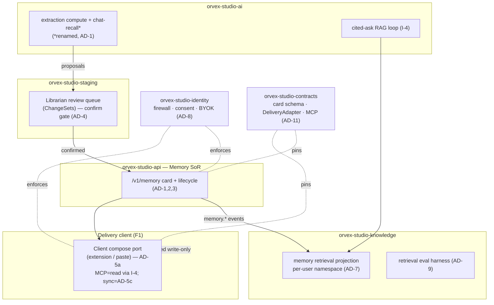
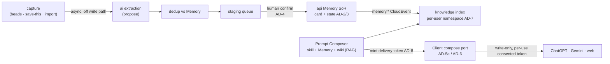

# Architecture Spine: Orvex Memory — Gap Closure

The consistency contract for the memory gap-closure (PRD `g9vWbSYplh`, features F0–F8). It fixes only the invariants the independently-built service slices (ai / knowledge / mcp / api / identity / staging + the delivery client) must share so they don't diverge. Rationale lives in the run memlog, not here.

**Paradigm.** *Curated cross-AI memory*: capture is **proposed** async → a **human confirms** → the confirmed card is owned by one **system of record** → **projected** for retrieval → **delivered** into any AI through a mechanism-agnostic adapter. Layered on the inherited family paradigm (Go six-tier services + the AGPL engine; cross-service only via the contracts seam).

## Inherited invariants (ADOPTED — binding, read-only)

- **I-1** Cross-service interaction only through `orvex-studio-contracts` (OpenAPI or a CloudEvent on the Kafka `studio-spine`); services never share a database; Postgres-only (no Mongo, D-S12).
- **I-2** Three stores (`rgBOQh31p3`): **Memory** (curated facts) · **wiki** (kept pages, draft→ratify) · **beads** (volatile agent narration, `orvex-studio-workgraph`/ADR-0025). RAG (Turbopuffer) is a mechanism, never a fourth store.
- **I-3** The Librarian confirm ritual (`fr7YaPq8Tl`): propose-and-confirm; a user-adjustable trust dial, but **edits / deletes / sensitive items are always human-gated**.
- **I-4** Retrieval is always a `knowledge` call made with the **caller's delegated principal**; knowledge's chokepoint enforces ACL ∩ token-scope regardless of caller. `ai` owns the cited-ask RAG loop (D-ASK). Billing owns entitlement caps; `ai` reads, never stores (D-P3).

## Architecture decisions

Each AD fixes an invariant two slices could otherwise choose incompatibly. `[ADOPTED]` = already settled by canon/reality.

**AD-1 — Memory ownership is split three ways.** *Binds:* who writes the Memory entity. *Prevents:* two owners of one card. *Rule:* (a) the product **Memory** card (curated fact + lifecycle + firewall scope) has exactly one system of record — **`orvex-studio-api` `/v1/memory`**; (b) **`ai`** owns extraction *compute* and its own ephemeral chat-recall (FR-AI11), which is **renamed** off the word "memory" to kill the collision; (c) **`knowledge`** owns the read-only retrieval **projection** (`source_type=memory` corpus). No service writes another's store. ⚠ **Conflict to surface:** the canonical `Architecture: orvex-studio-ai` (`Cb0XBkNezd`) currently claims `ai` holds "memory state / `/memories`" — AD-1 supersedes that and requires amending the ai architecture. Resolves OQ5 (the pending P1 naming ruling).

**AD-2 — The Memory card schema is a pinned contract.** *Binds:* the shape every slice reads/writes. *Prevents:* per-service field drift. *Rule:* the card carries `content`, `provenance/source`, `owner_scope` (`user|org`, nullable per AD-12), `sensitivity`, `confidence`, bi-temporal timestamps (AD-3), and `state`; it is **versioned** and defined in `orvex-studio-contracts`. Bodies cross boundaries as DfM/typed structs, never `any`.

**AD-3 — Memory is bi-temporal with an explicit state machine.** *Binds:* how a fact ages and how conflicts resolve. *Prevents:* stale facts surfacing as current; silent overwrite; an imported old fact masquerading as newest. *Rule:* every card has `observed_at` + `valid_from`/`valid_until`; states are `active | superseded | archived`; a contradiction is resolved by **Reconcile**, which **invalidates** the older assertion (never deletes) and is reversible. **`valid_from` is the fact's real-world time** sourced from the capture adapter's origin metadata, defaulting to `observed_at` **only** for live capture; **Reconcile orders strictly by `valid_from` (world-time), never by ingest time — so an import may never supersede a higher-`valid_from` active card.** `api` executes the transition; it never reconciles independently (AD-4). Deletion erases Orvex-controlled + vendor-API-deletable copies only (injected-into-session content is out of reach and disclosed at consent).

**AD-4 — The confirm gate is the *sole* mutation path into Memory.** *Binds:* every write to canon — create, edit, delete, and reconcile. *Prevents:* un-curated / poisoned writes; two paths racing the same card; an unowned reconcile. *Rule:* capture/extraction runs **async off the write path**; proposals land in the **`orvex-studio-staging`** review queue as Librarian **ChangeSets**; **all** create/edit/delete/reconcile flow through this one gate — there is no direct-write side channel. A supersede is a **field of the confirmed ChangeSet**, computed at dedup and **applied atomically by `api` on commit** (`api` never independently reconciles). A ChangeSet computed against card version V is **rebased**, not force-committed, if the card moved to V+1. Retrieved/captured content is untrusted **data, never instructions** (anti-poisoning, FR-S6/X6).

**AD-5 — Delivery is three distinct surfaces, not one port.** *Binds:* how memory reaches any AI. *Prevents:* three incompatible mechanisms (push-write / read-pull / persistent-sync) crammed behind one signature. *Rule:* memory reaches an AI by exactly one of:
- **(a) Client compose port** — `composeInto(target, text) -> {ok | needs-manual-paste}`, paradigm **user-triggered, write-only, single-session compose-box insertion** (browser-extension for ChatGPT/Gemini web; copy-paste fallback). The mechanism binding is **deferred** to the F1 viability spike; the port is fixed now.
- **(b) MCP retrieval surface** — for MCP-capable clients, memory is *read* as a `knowledge` tool call under the caller's delegated principal, governed by **I-4** (ACL ∩ scope), **not** by this port. MCP is not a compose adapter.
- **(c) Stateful sync surface** — writes a vendor's *persistent* memory (Claude adapter). It MUST NOT start until the outbound-sync conflict policy (OQ3) is resolved — that Deferred item is load-bearing for any v1 that ships surface (c).

**AD-6 — The client compose port carries a ToS-clean invariant.** *Binds:* what surface (a) may do. *Prevents:* the extension drifting into account-risking behavior or the CWS "AI-chatbot injector" ban. *Rule:* it (1) acts only in the user's already-authenticated session, (2) fires only on an explicit per-use action, (3) writes the input field only — never scrapes/parses model **Output** at scale, (4) never auto-sends without separate opt-in. Positioned as **compose-box autofill, explicitly distinct from prompt-injection tooling** — the category Chrome Web Store restricts from **2026-08-01** (Limited-Use data policy applies). Breakage is detected and fails loud to copy/paste (FR-D7); MV3 forbids server-side selector hot-patch, so resilient hooks + fast point-releases are required. **The F1 viability spike (OQ8) MUST re-check the CWS 2026-08-01 policy + Limited-Use rules before surface (a) ships.**

**AD-7 — Namespace isolation, keyed by owner scope.** *Binds:* the tenancy wall in retrieval *and* the namespace key. *Prevents:* cross-tenant leakage; and org memories silently vanishing or leaking because the key was ambiguous. *Rule:* memory retrieval uses a Turbopuffer **namespace wall** (the stronger grade, not attribute-scoped filtering); the **namespace key is the card's `owner_scope` identity** — `user-id` for a user card, `org-id` for an org card — derived at projection and carried on the `memory.*` event (AD-11). Retrieval queries **{caller user namespace} ∪ {caller org namespace filtered by the AD-8 firewall}**. Namespace-per-user is proven at scale (Turbopuffer runs 250M+ namespaces). Resolves OQ2. `[ASSUMPTION]` cost envelope confirmed in the knowledge fold-in.

**AD-8 — Consent binds at the mint boundary, not at the client compose.** *Binds:* where the trust boundary for private memory actually is. *Prevents:* a client (browser extension, outside `api`'s process) re-composing an already-fetched private card into a *different* target with no fresh check, and no deliver-time audit. *Rule:* the personal↔employer firewall and per-use consent are enforced at the **retrieval/mint** step, not at the (untrusted) client compose. A delivery fetch mints an **`identity`-owned, single-target, single-use, short-TTL consented delivery token** scoped to `{memory, target, user}`; the client **cannot compose without presenting one**, and every per-use action **re-mints** (a token for ChatGPT does not deliver to Gemini). The client-side compose is never itself a trust boundary. BYOK keys are managed via `identity`/KMS, per-tenant, enforced at the store layer.

**AD-9 — Quality has an owned eval harness with a regression gate.** *Binds:* how "good enough" is proven. *Prevents:* unmeasurable quality claims. *Rule:* `knowledge` owns the **retrieval** eval (recall@k / answer-correctness, golden sets); `ai` owns the **proposal-quality** eval (precision/recall). Both gate merges in CI. The raw wiki store stays searchable alongside distilled Memory (verbatim-beats-extracted ablation). Benchmark selection deferred (OQ4).

**AD-10 — Memory AI-cost rides the inherited budget spine.** *Binds:* how memory compute is capped. *Prevents:* bulk capture exhausting a user's AI allowance. *Rule:* memory LLM calls use `ai`'s per-caller scoped LiteLLM keys+budgets over the per-tenant `max_budget` (D-S5); **extraction/embedding runs on a separate nested budget** sized from the page quota (D-S15). Token-budgeted injection (F8) is an invariant; measurement specifics deferred. `[ADOPTED]`

**AD-11 — The memory seam is pinned in contracts, with per-card ordering and read-your-writes.** *Binds:* the cross-service surface *and* projection consistency. *Prevents:* drift across services; a `memory.superseded` overtaking its `memory.created`; and the "confirmed = visible" promise breaking because projection lagged the confirm. *Rule:* the Memory card schema (AD-2), the client compose port (AD-5a), and MCP memory additions are pinned in `orvex-studio-contracts`; `memory.*` CloudEvents ride `studio-spine` against golden fixtures, **partitioned by `card-id`** for per-card ordering, carrying a **monotonic card version** for idempotent last-writer-wins projection. Delivery reads are **read-your-writes for the confirming user** — the Composer reads the `api` SoR for that user's just-confirmed cards until projection catches up (or the confirm ack is withheld until it does). `[ADOPTED]` for the contracts seam; ordering/RYW is new.

**AD-12 — The data model is team-aware now, team-functional later.** *Binds:* the v1 shape that avoids a rewrite. *Prevents:* a schema migration when Teams lands. *Rule:* `owner_scope` is nullable `{user|org}` with free CAS concurrency from day one (AD-2); the full team surface — RBAC, moderation queue, governance models (F7) — is **deferred/phased** (OQ6) but writes against this fixed field. Respects the locked "team memory minimal in v1."

## Ownership map

## Memory data flow

## Deferred (named, not decided)

- **F1 delivery mechanism binding** — extension vs. bookmarklet vs. native helper; the port (AD-5) is fixed, the adapter impl waits on the legal+technical viability spike (OQ8).
- **Retrieval benchmark** — the harness (AD-9) is fixed; which public benchmark (LongMemEval/LoCoMo) is deferred (OQ4).
- **Team RBAC / moderation / governance depth** (F7) — field fixed (AD-12), surface phased (OQ6).
- **Outbound-sync conflict policy** — Orvex master vs. vendor-side divergence (OQ3). **Load-bearing gate:** delivery surface (c) (AD-5c) MUST NOT ship until this is resolved.
- **Token-cost measurement specifics** (F8) — the budget invariant (AD-10) is fixed; tuning deferred.

## Conflicts to surface (need a human ruling)

- **AD-1 vs. `Cb0XBkNezd`** — the canonical ai architecture says `ai` owns "memory state / `/memories`"; this spine puts the Memory SoR in `api` and renames ai's chat-recall. Confirm the ruling; if adopted, the ai architecture must be amended (fold-in step).
