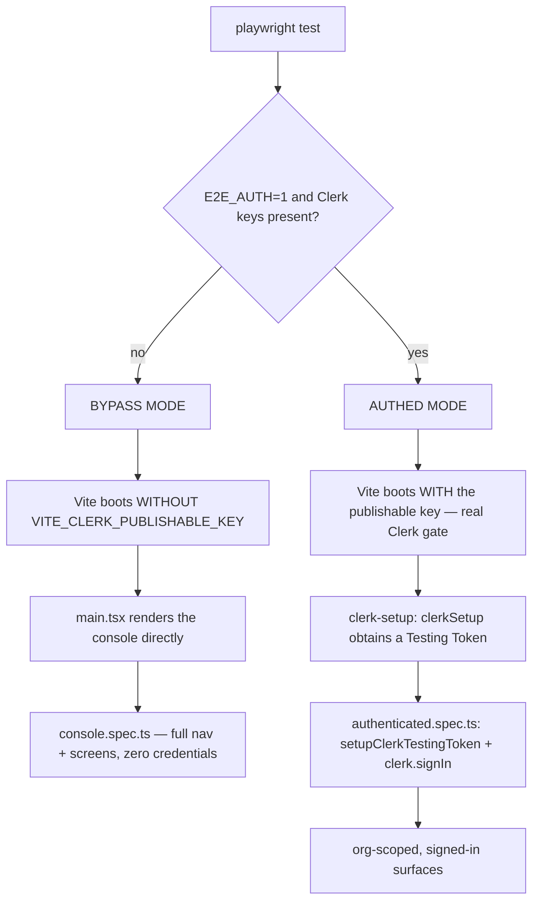

# E2E Testing — Playwright & Clerk
(status: draft, slug N1ZdF21bWq, space houston)

# E2E Testing — Playwright & Clerk

End-to-end browser tests for the **Flight Director** web console (`web/`) run on [Playwright](https://playwright.dev), locally only — they are not wired into CI. Authentication is the hard part: the sign-on screen is **Google-OAuth only** and the dev Clerk instance is **invitation-only with admin-created orgs**, so driving the login form does not work — there is no email/password form, you cannot script Google's real login, and a fresh account has no workspace to land in.

The harness solves this with **two run modes** behind a single `web/playwright.config.ts`. One needs no credentials; the other signs in **programmatically** through Clerk's testing helpers, never touching the Google UI.

## Why Clerk makes this hard

`web/src/main.tsx` decides the whole auth posture from one env var, `VITE_CLERK_PUBLISHABLE_KEY`:

- **Key absent** → the app renders the console directly. No `ClerkProvider`, no `LoginScreen`, no `OrganizationGate`; `CLERK_ENABLED` is false, admin surfaces stay hidden, identity is mocked. This is what `npm run dev` does locally.
- **Key present** → `SignedOut` shows `LoginScreen` (**Continue with Google** only) → `SignedIn` passes through `OrganizationGate` (auto-enters a sole org, picks among several, or **locks out** an account with none) → the console.

So two things gate the console: a **Google-only first factor** and **org membership**. Clerk's *Testing Tokens* only bypass bot detection on the Frontend API — they do **not** sign anyone in. Because the UI is OAuth-only, sign-in has to happen programmatically.

## The two-mode strategy



|  | Bypass (default) | Authenticated |
| --- | --- | --- |
| Trigger | `npm run test:e2e` | `npm run test:e2e:auth` (`E2E_AUTH=1`) |
| Clerk key at boot | none | publishable key injected into Vite |
| Credentials needed | **none** | dev-instance keys **+** a test user |
| Covers | console shell, full nav, every screen | the Clerk gate, `OrganizationGate`, signed-in identity, admin areas |

Each suite guards itself with `test.skip(...)`, so a plain `npx playwright test` runs the bypass suite green and silently skips the authenticated one when no secrets are present.

## Bypass mode — the default

Most of the surface (navigation, every screen, drill-downs) is auth-independent and renders off mock data in `web/src/data/`. Bypass mode tests it with no Clerk dependency at all — ideal for local runs.

```bash
cd web
npm run test:e2e          # bypass mode (no credentials)
npm run test:e2e:ui       # same, Playwright UI mode
npm run test:report       # open the last HTML report
```

`console.spec.ts` asserts the mission-control shell renders, that no Clerk gate leaks through (the *Continue with Google* button must be absent), that the full nav groups — **Watch · Plan · Govern · Spend · Configure** — are present, and that each tab routes to the screen whose `ViewHeader` `<h2>` it owns.

## Authenticated mode — programmatic sign-in

This follows Clerk's official Playwright integration, adapted for an OAuth-only, invitation-only instance. It uses `@clerk/testing`:

1. The `**clerk-setup**`** project** (`tests/global.setup.ts`) calls `clerkSetup()` once at suite start, obtaining a Testing Token and exporting `CLERK_FAPI` + `CLERK_TESTING_TOKEN` to the workers. It must be a **project-based** setup declared as a `dependencies` entry of the `chromium` project — a function `globalSetup` runs in a separate process and its env vars never reach the workers ("Clerk Frontend API URL is required.").
2. **Per test** (`tests/authenticated.spec.ts`): `setupClerkTestingToken({ page })` injects the token, then `clerk.signIn()` establishes a session without the Google UI, then a re-`goto('/')` lets `OrganizationGate` auto-enter the test user's sole org and drop into the console.

### Choosing a sign-in strategy

Because the UI exposes only Google, the test user needs a **non-OAuth factor** the helper can use:

| Strategy | What the test user needs | Notes |
| --- | --- | --- |
| `email_code` (default) | a `+clerk_test` email + email-code enabled | No real inbox — Clerk's test mode accepts the fixed OTP `424242`. |
| `password` | a password + password sign-in enabled | Set `E2E_CLERK_USER_PASSWORD`. |
| `ticket` | nothing on the user — a sign-in token minted via the Backend API | **Bulletproof for a strictly OAuth-only instance**: bypasses configured first factors. Mint it in setup with the secret key, pass as `signInParams.ticket`. |

> For a pure-OAuth instance (neither email-code nor password enabled), use the `ticket` strategy: mint a sign-in token via `POST /sign_in_tokens` and sign in with `{ strategy: 'ticket', ticket }`.

### Provisioning the test user (one-time, admin)

The instance is invitation-only, so the test user is admin-created in the dev Clerk instance:

1. Create a user with a `+clerk_test` email, e.g. `e2e+clerk_test@orvex.ai`.
2. **Add the user to a test organization** — `OrganizationGate` locks out any account with no workspace.
3. Enable the chosen first factor (email-code or password), or plan to use the `ticket` strategy.

### Running it

```bash
cd web
export CLERK_PUBLISHABLE_KEY=pk_test_…
export CLERK_SECRET_KEY=sk_test_…
export E2E_CLERK_USER_IDENTIFIER='e2e+clerk_test@orvex.ai'
# export E2E_CLERK_USER_PASSWORD=…              # only for the password strategy
npm run test:e2e:auth
```

> `npx clerk@latest env pull` writes the dev-instance keys into the env file without clobbering existing values. The keys live in the cluster as the `houston-clerk-credentials` secret (External Secrets) and are never committed.

## Files & layout

```
web/
  playwright.config.ts          # two modes, one config (BASE_URL :5180, viewport 1600×900)
  tests/
    global.setup.ts             # clerkSetup() — the project-based clerk-setup project
    console.spec.ts             # BYPASS suite — runs always, no credentials
    authenticated.spec.ts       # AUTHED suite — programmatic clerk.signIn(), gated on env
```

`package.json` scripts: `test:e2e` (bypass), `test:e2e:auth` (authed), `test:e2e:ui`, `test:report`; unit tests run under vitest. Artifacts (`test-results/`, `playwright-report/`) are git-ignored; the specs under `web/tests/` are tracked.

## Gotchas

- **Never add **`**--disable-web-security**` to Chromium launch args. It strips the `Origin` header, Clerk's FAPI then rejects the environment-config request, and the auth components silently degrade.
- `**clerkSetup()**`** must be project-based**, declared as a `dependencies` entry — a function `globalSetup` runs in a separate process and its env vars never reach the workers.
- **Org membership is mandatory.** A signed-in user with no org is locked out by `OrganizationGate`.
- **Testing Tokens ≠ login.** They bypass bot detection only; you still sign in programmatically.
- The `/api` proxy points at `localhost:8787`; with no API running, `HealthBanner` shows a non-blocking caution rail that tests ignore.

## Writing new tests

- Prefer **semantic locators** — `getByRole`, `getByText`, accessible names — over CSS or test ids (the app ships no `data-testid`s by design).
- Navigation is **state-based, not URL-routed**: click a tab `button` by its label, then assert the destination screen's `<h2>` via `getByRole('heading', { level: 2, name: … })`.
- Keep tests linear and assert visible outcomes, not implementation detail.
