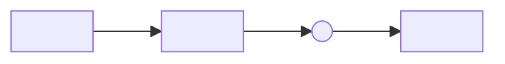

---
# Documentation Taxonomy — required native fields (mirror as YAML on Markdown round-trip)
status: draft
owner_id: ""
doc_type: trigger-map
# Optional fields — fill when applicable, remove if unused
# last_reviewed_at: 2026-05-15
# supersedes: []
# superseded_by:
# redirect_from: []
# tags: []
---

<!--
How to use this template
- Skill: wds-2-trigger-mapping
- Target location: /Product/Trigger-Map
- One-or-many: one per project (the canonical strategic reference)
- Lifecycle: status starts as `draft`; flip to `canonical` when business + UX agree the map represents current strategy;
  revise in-place when goals shift — do NOT create -v2 siblings.
- Method origin: Adapted from Effect Mapping (Mijo Balic & Ingrid Domingues, inUse). WDS variant: simplified (no features),
  enhanced with negative driving forces.
- Relationship to other types:
  - Personas are referenced from this map by slug (`persona/<name>`) — kept in their own pages, not duplicated here.
  - UX Specs link back to specific Trigger-Map entries for traceability.
-->

# Trigger Map — Replace with Project Title

<!-- One paragraph framing: which product this map serves and the time horizon it covers. -->

## Business goals

<!--
The handful of measurable outcomes this product exists to drive. 3–7 entries; more than that is a sign of unfocused strategy.

| Goal | Metric | Target | Time horizon |
|------|--------|--------|--------------|
| ...  | ...    | ...    | ...          |
-->

## Personas in scope

<!--
List the personas this map activates. Reference by slug — full persona docs live separately.

- [persona/<name>](persona/<name>) — short context line on why this persona matters here
-->

## Triggers (positive driving forces)

<!--
What pulls a persona toward a behaviour that advances a business goal. Each trigger is a *psychological state*,
not a UI feature. Group by persona.

### <Persona name>
- **<Trigger name>** — <description of the psychological state / unmet need / moment of motivation>
  - Drives goal: <goal>
  - Surface that serves it: <ux-spec or feature reference>
-->

## Counter-triggers (negative driving forces)

<!--
What pushes a persona away — fears, frictions, costs, distrust. WDS-specific extension to Effect Mapping.
Same shape as Triggers but inverted.

### <Persona name>
- **<Counter-trigger name>** — <description>
  - Threatens goal: <goal>
  - Surface that mitigates it: <ux-spec or feature reference>
-->

## Key insights

<!--
The patterns that emerged from triggers + counter-triggers. These are the design / strategy levers.
3–7 insights; if you have more, you haven't synthesised yet.

- **<Insight title>** — <one paragraph: what it is, why it matters, what we'll do about it>
-->

## Map diagram

<!--
Mermaid diagram tying goals → triggers → personas → surfaces.
See `data/mermaid-formatting-guide.md` in the wds-2-trigger-mapping skill for the canonical pattern.

-->

## Open questions

<!--
Strategic uncertainties that affect the map. Resolve before status flips to `canonical`.
-->

---

<!-- Footer / metadata that does NOT belong in front-matter -->

**Owner:** <handle>
**Last reviewed:** <YYYY-MM-DD>
